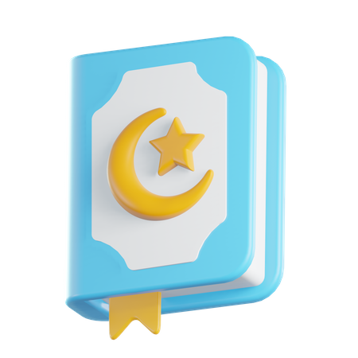

    
    <h1 align="center">Daily Quran</h1>

    

    
Daily Quran is a digital Al-Quran that can be used anywhere and anytime.

    <a href="https://dailyquran.rf.gd">View Demo</a>
    ·
    <a href="https://saweria.co/azein25">Donate</a>

## Technology used
- HTML
- CSS
- JavaScript
- PHP
- Bootstrap 5
- quran-api

## Development
### Sources
- Bootstrap 5 (https://getbootstrap.com/docs/5.1/getting-started/introduction/)
- quran-api (https://api.quran.sutanlab.id/)

### Installation
- Open the XAMPP application, then run the Apache modules.
- Open the `/htdocs` folder.
- Open Git Bash, then run `git clone https://github.com/zcode25/daily-quran.git`.
- Open `http://localhost/daily-quran` with your browser to see the result.

## Contribute
Please contribute! Issues and pull requests are welcome. Thank you for your help improving the e-shop software!

## Contacts
-  Email : adamzein345@gmail.com
-  Instagram 1 : [@azein25](https://www.instagram.com/azein25/)
-  Instagram 2 : [@zcode25](https://www.instagram.com/zcode25/)
